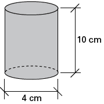

     É possível usar água ou comida para atrair as aves e observá-las. Muitas pessoas costumam usar água com açúcar, por exemplo, para atrair beija-flores. Mas é importante saber que, na hora de fazer a mistura, você deve sempre usar uma parte de açúcar para cinco partes de água. Além disso, em dias quentes, precisa trocar a água de duas a três vezes, pois com o calor ela pode fermentar e, se for ingerida pela ave, pode deixá-la doente. O excesso de açúcar, ao cristalizar, também pode manter o bico da ave fechado, impedindo-a de se alimentar. Isso pode até matá-la.

**Ciência Hoje das Crianças.** FNDE; Instituto Ciência Hoje, ano 19, no 166, mar. 1996.

Pretende-se encher completamente um copo com a mistura para atrair beija-flores. O copo tem formato cilíndrico, e suas medidas são 10 cm de altura e 4 cm de diâmetro. A quantidade de água que deve ser utilizada na mistura é cerca de (utilize $\pi = 3$)

- [ ] 20 mL.
- [ ] 24 mL.
- [x] 100 mL.
- [ ] 120 mL.
- [ ] 600 mL.

O volume V do copo em mL é

$V = \pi \cdot 2^2 \cdot 10$

$V = 3 \cdot 2^2 \cdot 10$

$V = 120 mL$

Vamos admitir que os volumes de açúcar e de água se somem; assim, para obtermos uma parte de açúcar para cinco de água, devemos ter:

volume de açúcar: $\cfrac{1}{6}V$

volume de água: $\cfrac{5}{6}V$

$\cfrac{5}{6} \cdot 120 = 100$

Ou seja, 100 mL de água.
