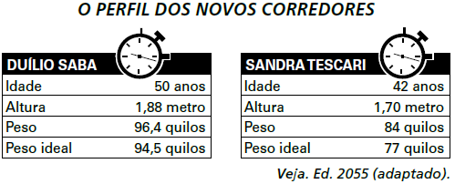
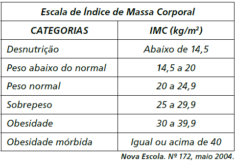

     A figura apresenta informações biométricas de um homem (Duílio) e de uma mulher (Sandra) que estão buscando alcançar seu peso ideal a partir das atividades físicas (corrida). Para se verificar a escala de obesidade, foi desenvolvida a fórmula que permite verificar o Índice de Massa Corporal (IMC). Esta fórmula é apresentada como IMC = $m/h^2$, onde m é a massa em quilogramas e h é altura em metros.

No quadro é apresentada a Escala de Índice de Massa Corporal com as respectivas categorias relacionadas aos pesos.

A partir dos dados biométricos de Duílio e Sandra e da Escala de IMC, o valor IMC e a categoria em que cada uma das pessoas se posiciona na Escala são

- [ ] Duílio tem o IMC 26,7 e Sandra tem o IMC 26,6, estando ambos na categoria de sobrepeso.
- [x] Duílio tem o IMC 27,3 e Sandra tem o IMC 29,1, estando ambos na categoria de sobrepeso.
- [ ] Duílio tem o IMC 27,3 e Sandra tem o IMC 26,6, estando ambos na categoria de sobrepeso.
- [ ] Duílio tem o IMC 25,6, estando na categoria de sobrepeso, e Sandra tem o IMC 24,7, estando na categoria de peso normal.
- [ ] Duílio tem o IMC 25,1, estando na categoria de sobrepeso, e Sandra tem o IMC 22,6, estando na categoria de peso normal.

Do enunciado, temos:

• IMC de Duílio:

$IMC_D = \cfrac{96,4}{(1,88)^2} = 27,3$

• IMC de Sandra:

$IMC_S = \cfrac{84}{(1,70)^2} = 29,1$

Logo, Duílio tem IMC 27,3 e Sandra tem IMC 29,1, estando ambos na categoria de sobrepeso.

        