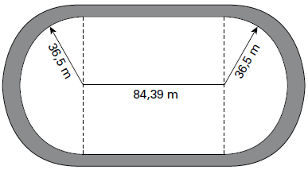

     O atletismo é um dos esportes que mais se identificam com o espírito olímpico. A figura ilustra uma pista de atletismo. A pista é composta por oito raias e tem largura de 9,76 m. As raias são numeradas do centro da pista para a extremidade e são construídas de segmentos de retas paralelas e arcos de circunferência. Os dois semicírculos da pista são iguais.

BIEMBENGUT, M. S. **Modelação Matemática como método de ensino-aprendizagem de Matemática em cursos de 1º e 2º graus.** 1990. Dissertação de Mestrado. IGCE/UNESP, Rio Claro, 1990 (adaptado).

Se os atletas partissem do mesmo ponto, dando uma volta completa, em qual das raias o corredos estaria sendo beneficiado?

- [x] 1
- [ ] 4
- [ ] 5
- [ ] 7
- [ ] 8

Os arcos de circunferência que delimitam a raia 1 são os de menor comprimento. Assim, o corredor da raia 1 seria aquele que percorre a menor distância, sendo beneficiado.
