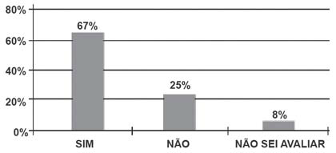

     Uma enquete, realizada em março de 2010, perguntava aos internautas se eles acreditavam que as atividades humanas provocam o aquecimento global. Eram três as alternativas possíveis e 279 internautas responderam à enquete, como mostra o gráfico.

Analisando os dados do gráfico, quantos internautas responderam “NÃO” à enquete?

- [ ] Menos de 23.
- [ ] Mais de 23 e menos de 25.
- [x] Mais de 50 e menos de 75.
- [ ] Mais de 100 e menos de 190.
- [ ] Mais de 200.

O número x de internautas que responderam NÃO será dado por:

Internautas          %\
279                    100\
x                        25

x = 69,75.

Logo, mais de 50 e menos de 75 internautas.

        