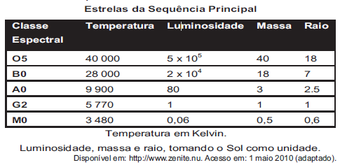

     A cor de uma estrela tem relação com a temperatura em sua superfície. Estrelas não muito quentes (cerca de 3 000 K) nos parecem avermelhadas. Já as estrelas amarelas, como o Sol, possuem temperatura em torno dos 6 000 K; as mais quentes são brancas ou azuis porque sua temperatura fica acima dos 10 000 K.

     A tabela apresenta uma classificação espectral e outros dados para as estrelas dessas classes.

Se tomarmos uma estrela que tenha temperatura 5 vezes maior que a temperatura do Sol, qual será a ordem de grandeza de sua luminosidade?

- [x] 20 000 vezes a luminosidade do Sol.
- [ ] 28 000 vezes a luminosidade do Sol.
- [ ] 28 850 vezes a luminosidade do Sol.
- [ ] 30 000 vezes a luminosidade do Sol.
- [ ] 50 000 vezes a luminosidade do Sol.

Entre as estrelas das classes espectrais representadas na tabela, a que tem temperatura em torno de 5 vezes mais que a do Sol é da Classe Espectral B0.

Assim, sua luminosidade é $2 \cdot 10^4$, ou seja, é 20 000 vezes a luminosidade do Sol.
