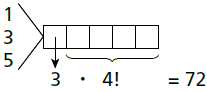
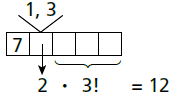
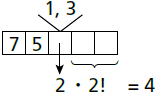
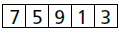

     O setor de recursos humanos de uma empresa vai realizar uma entrevista com 120 candidatos a uma vaga de contador. Por sorteio, eles pretendem atribuir a cada candidato um número, colocar a lista de números em ordem numérica crescente e usá-la para convocar os interessados. Acontece que, por um defeito do computador, foram gerados números com 5 algarismos distintos e, em nenhum deles, apareceram dígitos pares. Em razão disso, a ordem de chamada do candidato que tiver recebido o número 75 913 é

- [ ] 24\.
- [ ] 31\.
- [ ] 32\.
- [ ] 88\.
- [x] 89\.

Usando apenas algarismos ímpares (1, 3, 5, 7, 9), temos:

**ou (+)**

**ou (+)**

****

**ou (+)**

$=\cfrac{1}{89}$

O candidato que tiver recebido o número 75 913 terá ordem de chamada igual a 89.
