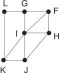
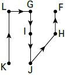

     Um técnico em refrigeração precisa revisar todos os pontos de saída de ar de um escritório com várias salas. Na imagem apresentada, cada ponto indicado por uma letra é a saída do ar, e os segmentos são as tubulações.

Iniciando a revisão pelo ponto K e terminando em F, sem passar mais de uma vez por cada ponto, o caminho será passando pelos pontos

- [ ] K, I e F.
- [ ] K, J, I, G, L e F.
- [x] K, L, G, I, J, H e F.
- [ ] K, J, H, I, G, L e F.
- [ ] K, L, G, I, H, J e F.

A partir da figura, temos o caminho:

