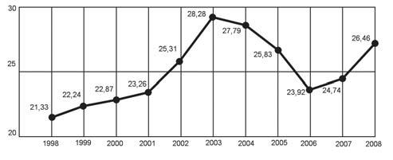

     O termo agronegócio não se refere apenas à agricultura e à pecuária, pois as atividades ligadas a essa produção incluem fornecedores de equipamentos, serviços para a zona rural, industrialização e comercialização dos produtos.

O gráfico seguinte mostra a participação percentual do agronegócio no PIB brasileiro:

Centro de Estudos Avançados em Economia Aplicada (CEPEA).\
**Almanaque abril 2010. **São Paulo: Abril, ano 36 (adaptado).

Esse gráfico foi usado em uma palestra na qual o orador ressaltou uma queda da participação do agronegócio no PIB brasileiro e a posterior recuperação dessa participação, em termos percentuais.

Segundo o gráfico, o período de queda ocorreu entre os anos de

- [ ] 1998 e 2001.
- [ ] 2001 e 2003.
- [x] 2003 e 2006.
- [ ] 2003 e 2007.
- [ ] 2003 e 2008.

Analisando o gráfico, constata-se que o único período em que houve queda da participação do agronegócio no PIB brasileiro foi entre os anos de 2003 e 2006.

        