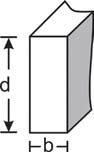

# q
     A resistência das vigas de dado comprimento é diretamente proporcional à largura (b) e ao quadrado da altura (d), conforme a figura. A constante de proporcionalidade k varia de acordo com o material utilizado na sua construção.

Considerando-se S como a resistência, a representação algébrica que exprime essa relação é

# a
$S = k \cdot b \cdot d$

# b
$S = b \cdot d^2$

# c
$S = k \cdot b \cdot d^2$

# d
$S = \cfrac{k \cdot b}{d^2}$

# e
$S = \cfrac{k \cdot d^2}{b}$

# r
c

# s
Como S é diretamente proporcional a b e também a $d^2$, então S é diretamente proporcional ao produto $bd^2$.

Assim, a representação algébrica que exprime essa relação é:

$S = k \cdot b \cdot d^2$
