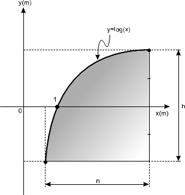
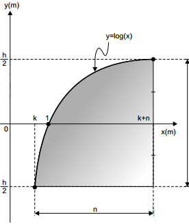

Um engenheiro projetou um automóvel cujos vidros das portas dianteiras foram desenhados de forma que suas bordas superiores fossem representadas pela curva de equação y = log(x), conforme a figura.

A forma do vidro foi concebida de modo que o eixo x sempre divida ao meio a altura h do vidro e a base do vidro seja paralela ao eixo x. Obedecendo a essas condições, o engenheiro determinou uma expressão que fornece a altura h do vidro em função da medida n de sua base, em metros.

A expressão algébrica que determina a altura do vidro é

- [ ] $\log({\cfrac{n + \sqrt{n^2 + 4}}{2}}) -\log({\cfrac{n - \sqrt{n^2 + 4}}{2}})$
- [ ] $\log(1 + \cfrac{n}{2}) -\log(1 - \cfrac{n}{2})$
- [ ] $\log(1 + \cfrac{n}{2}) +\log(1 - \cfrac{n}{2})$
- [ ] $\log({\cfrac{n + \sqrt{n^2 + 4}}{2}})$
- [x] $2\log({\cfrac{n + \sqrt{n^2 + 4}}{2}})$

$\log(k+n) = \cfrac{h}{2}$  =>  $h = 2 \cdot \log(k+n)$

$\log(k) = -\cfrac{h}{2}$  =>  $h = -2\log(k)$

$2 \cdot \log(k+n) = -2 \cdot \log(k)$

$\log(k+n) = -\log (k)$

$\log(k+n) +\log(k) = 0$

$\log\[(k+n) \cdot k] = 0$

$(k + n) \cdot k = 1$

$k^2 + nk - 1 = 0$

$k = \cfrac{-n+ \sqrt{n^2 +4} }{2}, k>0$

 

Como $h = 2\cdot \log(k+n)$, então :

$h = 2 \cdot \log(\cfrac{-n + \sqrt{n^2+4}}{2} + n)$

 

Que equivale a :

$2\log({\cfrac{n + \sqrt{n^2 + 4}}{2}})$

 

 

        