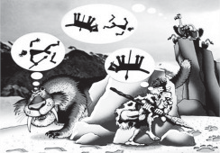

Os personagens da figura estão representando uma situação hipotética de cadeia alimentar.

Disponível em: http://www.cienciasgaspar.blogspot.com.

Suponha que, em cena anterior à apresentada, o homem tenha se alimentado de frutas e grãos que conseguiu coletar. Na hipótese de, nas próximas cenas, o tigre ser bem-sucedido e, posteriormente, servir de alimento aos abutres, tigre e abutres ocuparão, respectivamente, os  y 

- [ ] produtor e consumidor primário.
- [ ] consumidor primário e consumidor secundário.
- [x] consumidor secundário e consumidor terciário.
- [ ] consumidor terciário e produtor.
- [ ] consumidor secundário e consumidor primário.

O homem, ao comer vegetais, é consumidor primário; o tigre seria, então, consumidor secundário, e o abutre, consumidor terciário.
