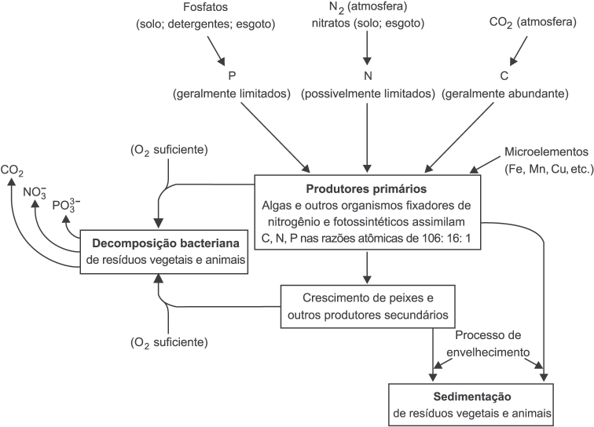
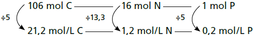

     A eutrofização é um processo em que rios, lagos e mares adquirem níveis altos de nutrientes, especialmente fosfatos e nitratos, provocando posterior acúmulo de matéria orgânica em decomposição. Os nutrientes são assimilados pelos produtores primários e o crescimento desses é controlado pelo nutriente limítrofe, que é o elemento menos disponível em relação à abundância necessária à sobrevivência dos organismos vivos. O ciclo representado na figura seguinte reflete a dinâmica dos nutrientes em um lago.

A análise da água de um lago que recebe a descarga de águas residuais provenientes de lavouras adubadas revelou as concentrações dos elementos carbono (21,2 mol/L), nitrogênio (1,2 mol/L) e fósforo (0,2 mol/L). Nessas condições, o nutriente limítrofe é o

- [ ] C.
- [x] N.
- [ ] P.
- [ ] $\ce{CO2}$.
- [ ] $PO\_4^{3-}$.

A figura fornecida na questão informa que tanto algas como outros organismos fixadores de nitrogênio e fotossintéticos assimilam C, N e P nas razões atômicas de 106 : 16 : 1.

Logo:

Assim, o nutriente limítrofe é o nitrogênio, pois apresenta a menor proporção em mol.
