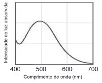
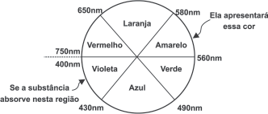

     Para que uma substância seja colorida ela deve absorver luz na região do visível. Quando uma amostra absorve luz visível, a cor que percebemos é a soma das cores restantes que são refletidas ou transmitidas pelo objeto. A Figura 1 mostra o espectro de absorção para uma substância e é possível observar que há um comprimento de onda em que a intensidade de absorção é máxima. Um observador pode prever a cor dessa substância pelo uso da roda de cores (Figura 2): o comprimento de onda correspondente à cor do objeto é encontrado no lado oposto ao comprimento de onda da absorção máxima.

Figura 1\

Figura 2\

Brown, T.** Química a Ciência Central.** 2005 (adaptado).

Qual a cor da substância que deu origem ao espectro da Figura 1?

- [ ] Azul.
- [ ] Verde.
- [ ] Violeta.
- [ ] Laranja.
- [x] Vermelho.

De acordo com o espectro de absorção, observa-se que o comprimento de onda em que ocorre a intensidade de absorção máxima é próximo a 500 nm. Por meio da roda das cores, verifica-se que a cor oposta a esse comprimento de onda é o vermelho.
