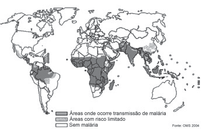

Disponível em: www.anvisa.gov.br.

O mapa mostra a área de ocorrência da malária no mundo. Considerando-se sua distribuição na América do Sul, a malária pode ser classificada como

- [x] endemia, pois se concentra em uma área geográfica restrita desse continente.
- [ ] peste, já que ocorre nas regiões mais quentes do continente.
- [ ] epidemia, já que ocorre na maior parte do continente.
- [ ] surto, pois apresenta ocorrência em áreas pequenas.
- [ ] pandemia, pois ocorre em todo o continente.

A malária afeta um número relativamente constante de indivíduos ao longo do tempo em algumas regiões da América, como aquelas assinaladas no mapa, e por isso é ali uma doença endêmica.
