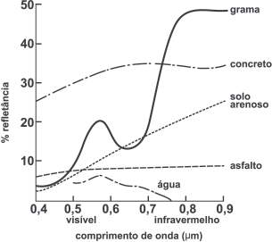

     O processo de interpretação de imagens capturadas por sensores instalados a bordo de satélites que imageiam determinadas faixas ou bandas do espectro de radiação eletromagnética (REM) baseiam-se na interação dessa radiação com os objetos presentes sobre a superfície terrestre. Uma das formas de avaliar essa interação é por meio da quantidade de energia refletida pelos objetos. A relação entre a refletância de um dado objeto e o comprimento de onda da REM é conhecida como curva de comportamento espectral ou assinatura espectral do objeto, como mostrado na figura, para objetos comuns na superfície terrestre.

D’ARCO, E.** Radiometria e Comportamento Espectral de Alvos.** INPE.\
Disponível em: http://www.agro.unitau.br. Acesso em: 3 maio 2009.

De acordo com as curvas de assinatura espectral apresentadas na figura, para que se obtenha a melhor discriminação dos alvos mostrados, convém selecionar a banda correspondente a que comprimento de onda em micrômetros (μm)?

- [ ] 0,4 a 0,5.
- [ ] 0,5 a 0,6.
- [ ] 0,6 a 0,7.
- [ ] 0,7 a 0,8.
- [x] 0,8 a 0,9.

Para obter-se a melhor distinção dos alvos, deve-se selecionar a banda de comprimentos de onda em que as porcentagens de refletância não apresentem valores iguais para materiais diferentes e não mostrem valores muito próximos entre si.

Portanto, observando-se a curva de comportamento espectral apresentada, a banda mais apropriada é a que possui comprimentos de onda entre 0,8 e 0,9μm.

        