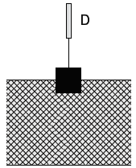
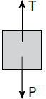
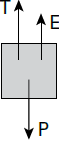

     Em um experimento realizado para determinar a densidade da água de um lago, foram utilizados alguns materiais conforme ilustrado: um dinamômetro D com graduação de 0 N a 50 N e um cubo maciço e homogêneo de 10 cm de aresta e 3 kg de massa. Inicialmente, foi conferida a calibração do dinamômetro, constatando-se a leitura de 30 N quando o cubo era preso ao dinamômetro e suspenso no ar. Ao mergulhar o cubo na água do lago, até que metade do seu volume ficasse submersa, foi registrada a leitura de 24 N no dinamômetro.

Considerando que a aceleração da gravidade local é de $10\\,m/ s^2$, a densidade da água do lago, em $g/cm^3$, é

- [ ] 0,6.
- [x] 1,2.
- [ ] 1,5.
- [ ] 2,4.
- [ ] 4,8.

Na situação em que o cubo está suspenso no ar, temos:

Estando o corpo em repouso, a resultante das forças nele aplicadas é nula.

A indicação do dinamômetro é a intensidade da tração T. Portanto:

P = T

P = 30 N

Na situação em que o cubo está parcialmente imerso na água do lago, temos:

Nessa nova situação do equilíbrio, a indicação do dinamômetro é 24 N. Portanto:

T + E = P

E = 30 – 24

E = 6 N

A intensidade do empuxo é igual à intensidade do peso do líquido deslocado ($E = d_L \cdot V\_{LD} \cdot g$). Pelo texto, o volume do líquido deslocado é metade do volume do cubo. Temos:

$V\_{LD} = \cfrac{1}{2}V_C$

$V\_{LD} = \cfrac{1}{2} \cdot (0,1)^3$

$V\_{LD} = 5 \cdot 10^{-4} \\, m^3$

Procedendo às devidas substituições numéricas na expressão do empuxo:

$E = d_L \cdot V\_{LD} \cdot g$

$6 = d_L \cdot 5 \cdot 10^{-4} \cdot 10$

$d_L = 1,2 \cdot 10^{-3} \\, kg/m^3$

$d_L = 1,2 \\, g/cm^3$

        