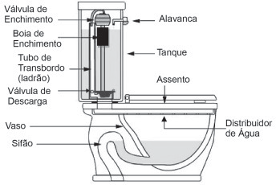

     Um tipo de vaso sanitário que vem substituindo as válvulas de descarga está esquematizado na figura. Ao acionar a alavanca, toda a água do tanque é escoada e aumenta o nível no vaso, até cobrir o sifão. De acordo com o Teorema de Stevin, quanto maior a profundidade, maior a pressão. Assim, a água desce levando os rejeitos até o sistema de esgoto. A válvula da caixa de descarga se fecha e ocorre o seu enchimento. Em relação às válvulas de descarga, esse tipo de sistema proporciona maior economia de água.

**Faça você mesmo.** Disponível em: http://www.facavocemesmo.net. Acesso em: 22 jul. 2010.

A característica de funcionamento que garante essa economia é devida

- [ ] à altura do sifão de água.
- [x] ao volume do tanque de água.
- [ ] à altura do nível de água no vaso.
- [ ] ao diâmetro do distribuidor de água.
- [ ] à eficiência da válvula de enchimento do tanque.

O sistema apresentado utiliza sempre o mesmo volume de água na descarga, ao contrário de outros, nos quais o volume de água escoado é determinado pelo intervalo de tempo em que o usuário aciona a válvula.
