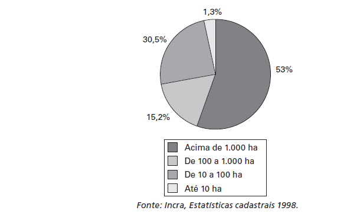

O gráfico representa a relação entre o tamanho e a totalidade dos imóveis rurais no Brasil. Que característica da estrutura fundiária brasileira está evidenciada no gráfico apresentado?

- [x] A concentração de terras nas mãos de poucos.
- [ ] A existência de poucas terras agricultáveis.
- [ ] O domínio territorial dos minifúndios.
- [ ] A primazia da agricultura familiar.
- [ ] A debilidade dos plantations modernos.

O gráfico fornecido na questão não representa, de forma clara, a relação entre a extensão e a totalidade dos imóveis rurais, que foi pedida no enunciado. A ausência de um título apropriado, somada à legenda contida em seu enunciado, levariam o candidato a interpretar que 53% dos imóveis rurais têm mais de 1.000 hectares, e 1,3% das propriedades no campo têm até 10 hectares. Desse modo, no Brasil, a imensa maioria dos proprietários de terras seriam latifundiários, enquanto uma pequena fração dos donos de terras seriam minifundiários, justamente o oposto da realidade rural brasileira.

        