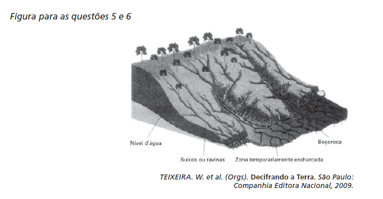

O esquema representa um processo de erosão em encosta. Que prática realizada por um agricultor pode resultar em aceleração desse processo?

- [ ] Plantio direto.
- [ ] Associação de culturas.
- [ ] Implantação de curvas de nível.
- [x] Aração do solo, do topo ao vale.
- [ ] Terraceamento na propriedade.

A prática da aração dos solos em áreas de encostas, dos topos até os vales, torna-os mais suscetíveis às intempéries da natureza, pois essa ação desagrega as partículas que os compõem, potencializando os processos de erosão nessas áreas.

        