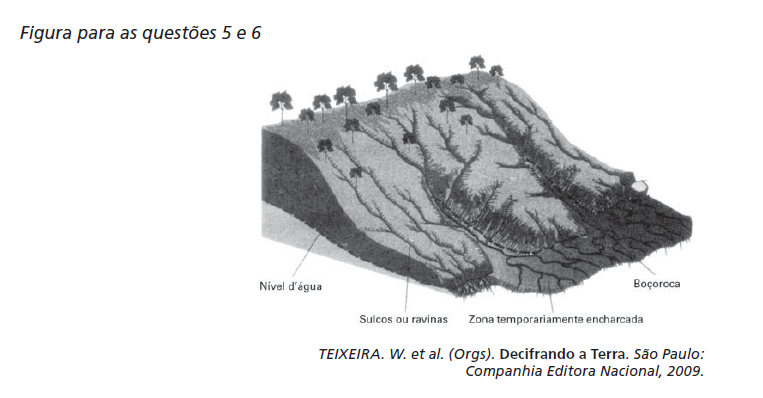

Muitos processos erosivos se concentram nas encostas, principalmente aqueles motivados pela água e pelo vento. No entanto, os reflexos também são sentidos nas áreas de baixada, onde geralmente há ocupação urbana. Um exemplo desses reflexos na vida cotidiana de muitas cidades brasileiras é

- [x] a maior ocorrência de enchentes, já que os rios assoreados comportam menos água em seus leitos.
- [ ] a contaminação da população pelos sedimentos trazidos pelo rio e carregados de matéria orgânica.
- [ ] o desgaste do solo em áreas urbanas, causado pela redução do escoamento superficial pluvial na encosta.
- [ ] a maior facilidade de captação de água potável para o abastecimento público, já que é maior o efeito do escoamento sobre a infiltração.
- [ ] o aumento da incidência de doenças como a amebíase na população urbana, em decorrência do escoamento de água poluída do topo das encostas.

As consequências do processo de erosão em encostas não se limitam apenas às áreas afetadas. Os sedimentos transportados pelas águas são levados para as áreas mais baixas e os leitos dos rios. O acúmulo de sedimentos nesses leitos, fenômeno conhecido como assoreamento, diminui o volume das suas calhas, produzindo, nos períodos de chuvas, enchentes de maiores proporções no local.
