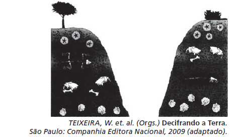

O esquema mostra depósitos em que aparecem fósseis de animais do Período Jurássico. As rochas em que se encontram esses fósseis são

- [ ] magmáticas, pois a ação de vulcões causou as maiores extinções desses animais já conhecidas ao longo da história terrestre.
- [x] sedimentares, pois os restos podem ter sido soterrados e litificados com o restante dos sedimentos.
- [ ] magmáticas, pois são as rochas mais facilmente erodidas, possibilitando a formação de tocas que foram posteriormente lacradas.
- [ ] sedimentares, já que cada uma das camadas encontradas na figura simboliza um evento de erosão dessa área representada.
- [ ] metamórficas, pois os animais representados precisavam estar perto de locais quentes.

As rochas ilustradas são sedimentares, formadas pela deposição de sedimentos provenientes de rochas mais antigas e restos de matéria orgânica animal e vegetal. A deposição, combinada a outros processos geológicos — como a litificação, a compactação e a cimentação —, originaram essas rochas, que apresentam como uma das suas principais características a estratificação de camadas.

        