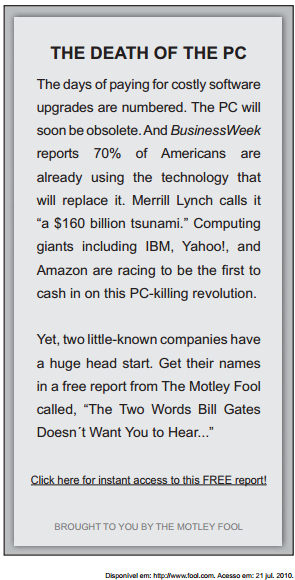

# q

Ao optar por ler a reportagem completa sobre o assunto anunciado, tem-se acesso a duas palavras que Bill Gates não quer que o leitor conheça e que se referem

# a
aos responsáveis pela divulgação desta informação na internet.

# b
às marcas mais importantes de microcomputadores do mercado.

# c
aos nomes dos americanos que inventaram a suposta tecnologia.

# d
aos sites da internet pelos quais o produto já pode ser conhecido.

# e
às empresas que levam vantagem para serem suas concorrentes.

# r
e

# s
Bill Gates não quer que o leitor conheça os nomes de duas empresas que levam vantagem para serem suas concorrentes. Lê-se no texto: “Get their names in a free report from The Motley Fool called, ‘The Two Words Bill Gates Doesn’t Want You to Hear…’”
