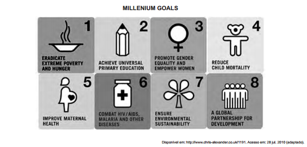

Definidas pelos países membros da Organização das Nações Unidas e por organizações internacionais, as metas de desenvolvimento do milênio envolvem oito objetivos a serem alcançados até 2015. Apesar da diversidade cultural, esses objetivos, mostrados na imagem, são comuns ao mundo todo, sendo dois deles:

- [ ] O combate à AIDS e a melhoria do ensino univer - sitário.
- [ ] A redução da mortalidade adulta e a criação de parcerias globais.
- [x] A promoção da igualdade de gêneros e a erradicação da pobreza.
- [ ] A parceria global para o desenvolvimento e a valorização das crianças.
- [ ] A garantia da sustentabllidade ambiental e o combate ao trabafho infantil.

Dois dos objetivos mostrados na imagem são: a promoção da igualdade de gêneros e a erradicação da pobreza. No texto: “Promote gender equality…” (= Promover a igualdade de gêneros…). “Erradicate extreme poverty…” (= Erradicar a pobreza extrema…).
