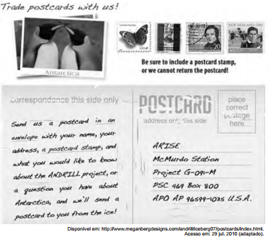

Os cartões-postais costumam ser utilizados por viajantes que desejam enviar notícias dos lugares que visitam a parentes e amigos. Publicado no site do projeto ANDRILL, o texto em formato de cartão-postal tem o propósito de

- [ ] comunicar o endereço da nova sede do projeto nos Estados Unidos.
- [ ] convidar colecionadores de cartões-postais a se reuni - rem em um evento.
- [ ] anunciar uma nova coleção de selos para angariar fundos para a Antártica.
- [x] divulgar às pessoas a possibilidade de receberem um cartão-postal da Antártica.
- [ ] solicitar que as pessoas visitem o site do mencionado projeto com major frequência.

O texto tem o propósito de divulgar às pessoas a possibilidade de receberem um cartão-postal da Antártica. Lê-se no texto: “… or a question you have about Antarctica, and we’ll send a postcard to you from the ice!” \* postcard = cartão-postal \* ice = gelo
